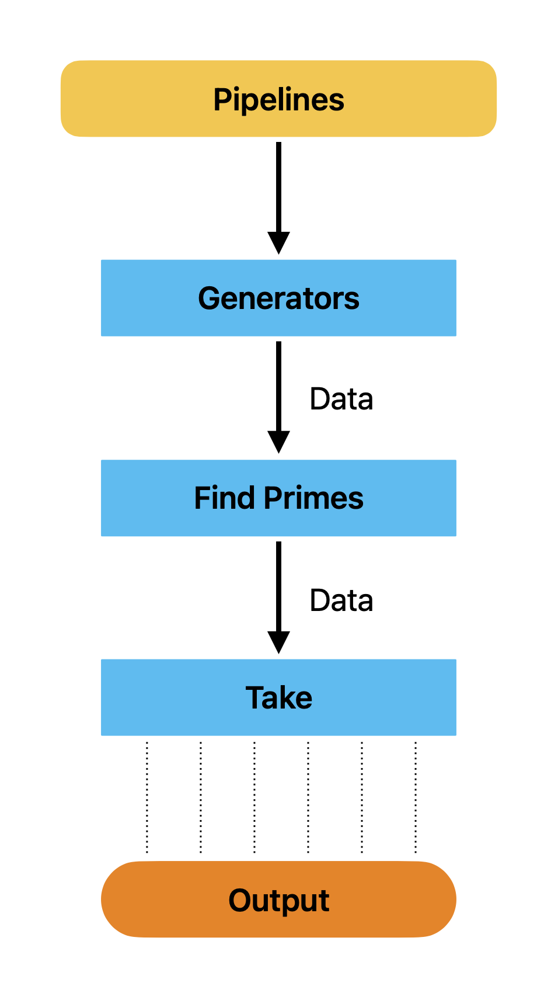
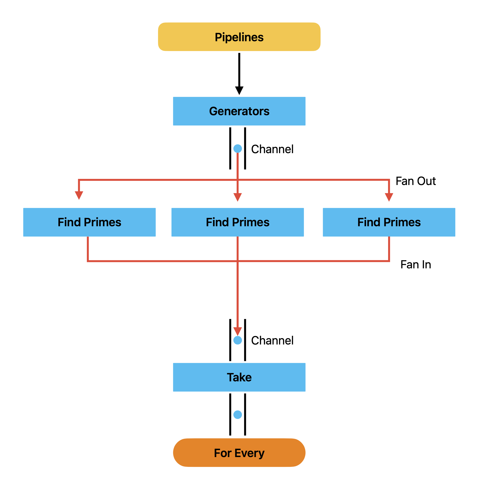

# Go Routine Channel

## Generators 

* Generate a stream of data on a channel. 

* In concept of a pipeline. 

* Generators are going to function, generate infinite of data which comes from another function


* This code will helps to generate multiple numbers infinitely max of 500,000,000 


```
    func repeatFunc[T any, K any](done <- chan K, fn func() T) <-chan T {
        stream := make(chan T)
        go func() {
            defer close(stream)
            for {
                select{
                case <- done:
                    return
                case stream <- fn():
                }
            }
        }()
        return stream
    }

    func main() { 
        done := make(chan int)
        defer close(done)

        randNumFetcher := func() int { return rand.Intn(500000000)}

        for rando := range repeatFunc(done, randNumFetcher) {
            fmt.Println(rando)
        }
    }
```

## Output 

```
    337972534
    365975293
    29102738
    189378798
    19647910
    ...
    ...
```

* The above program will works with any function is not void. (No return value)

* We are returning the stream, Go routine will continously send the data to stream. 


## Pipelines and Pipelines Stages. 

* Repeat Function and generators of code. 

### Repeat Function

```
    func repeatFunc[T any, K any](done <- chan K, fn func() T) <-chan T {
        stream := make(chan T)
        go func() {
            defer close(stream)
            for {
                select{
                case <- done:
                    return
                case stream <- fn():
                }
            }
        }()
        return stream
    }

```

* On case stream, go routine is blocked. 

* Receiving will takes no value, This will gives fine grain control over the amount of data that gents generated by our generator. 

### Generators. 

```
    func take[T any, K any](done <- chan K, stream <- chan T, n int) <- chan T {
	taken := make(chan T)
	go func() {
		defer close(taken)

		for i :=0; i < n; i++ {
			select {
			case <- done: 
			return 
			case taken <- <-stream:
			}
		}
	}()
	return taken
}
```

* Prime Finder function. 

```
    func primeFinder(done <-chan int, randIntStream <-chan int) <-chan int {
        isPrime := func(randomInt int) bool {
            for i := randomInt - 1; i > 1; i-- {
                if randomInt % i == 0 {
                    return false
                }
            }
            return true
        }
        primes := make(chan int)
        go func() {
            defer close(primes)
            for { 
                select {
                case <- done: 
                return
                case randomInt := <-randIntStream:
                    if isPrime(randomInt) {
                        primes <- randomInt
                    }
                }
            }
        }()
        return primes
    }

```

* This function helps to find the prime go up to 500 million. This function is going to be really slow and depending on how large our random int is. 

* So, essentially we're trying to create a slow pipeline stage. 

<p align="center">
  
</p>


* Find Prime will take more time, we need to add Find Prime instances concurrently. That will make the processing find prime much faster. 

```
/workspaces/System-Designs/generators (main) $ go run main.go 
64295783
332125033
206600791
282137437
144595499
469175467
64716143
377074541
298479791
28737581
53.322659849s
```

* Here it will take about 54 seconds. 


## Fan In, Fan Out 

* In Fan In, Fan Out. Here we are increase or scale up the number of find Prime go routines that are running at one core. 

* It looks like, each find prime is going to be outputting its own Find Prime channel. Fan Out

* The results of each Find prime channels, and integrate to the Fan In Channel. 

<p align="center">
  
</p>


* CPU Count of the system can be checked using. 

```
    CPUCount := runtime.NumCPU() 
```

* Fan In, Fan Out channels can be noted as below: 

### main.go file.
```
    // fan out 

	CPUCount := runtime.NumCPU()
	fmt.Println(CPUCount)
	primeFinderChannels := make([]<-chan int, CPUCount)

	for i := 0; i < CPUCount; i++ {
		primeFinderChannels[i] = primeFinder(done, randIntStream)
	}

	// fan in 

	fannedInStream := fanIn(done, primeFinderChannels...)
	for rando := range take(done, fannedInStream, 10){
			fmt.Println(rando)
	} 
```

* In Fan In, Channel we will take all the primeFinderChannels...  

```
    fannedInStream := fanIn(done, primeFinderChannels...)
```

### FanIn Function 


```
func fanIn[T any](done <-chan int, channels ...<-chan T) <-chan T {
	var wg sync.WaitGroup 
	fannedInStream := make(chan T)

	transfer := func(c <-chan T) {
		defer wg.Done()
		for i := range c {
			select {
			case <- done:
				return
			case fannedInStream <- i:

			}
		}
	}

	for _, c := range channels {
		wg.Add(1)
		go transfer(c)
	}

	go func() {
		wg.Wait()
		close(fannedInStream)
	}()

	return fannedInStream
}
```

* fanIn function is an generic, It takes done channel, all channels. 

* We use wait group, fanned In channel with fannedInStream. This function will just call this one transfer because it just going to transfer data from one channel to another channel. 

* Here all channels has resulting primes, These resulting will pass it single channel. all result will end up at fannedInStream. 

* We add wait group of Wait, Once received all the transfer will finished, and go routine will close the fannedInStream. 

* 


## Output 

```
    415414691
    317185853
    51851651
    396336331
    332751113
    36114959
    254606383
    241245457
    322945939
    406450903
    1m21.399913176s
```
