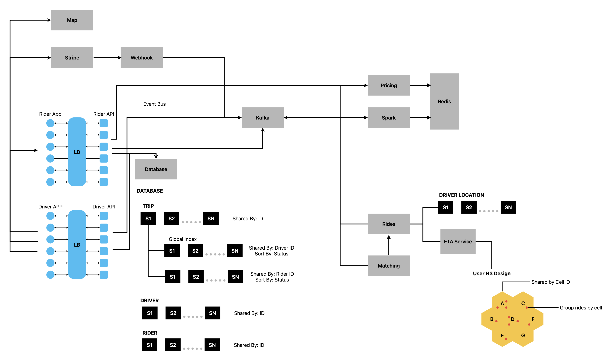
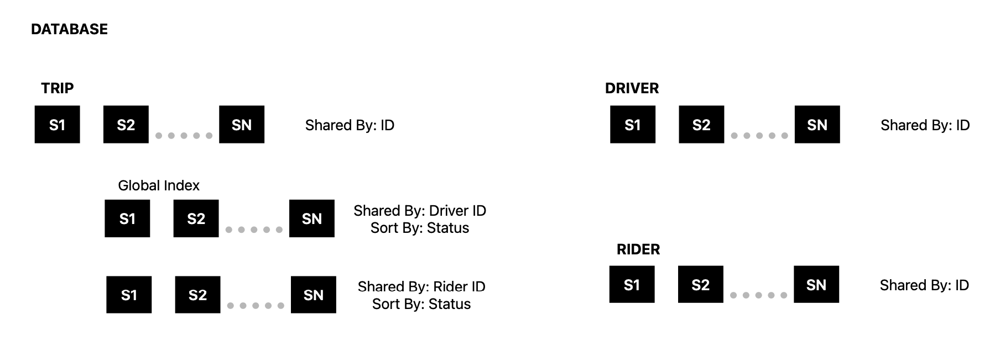
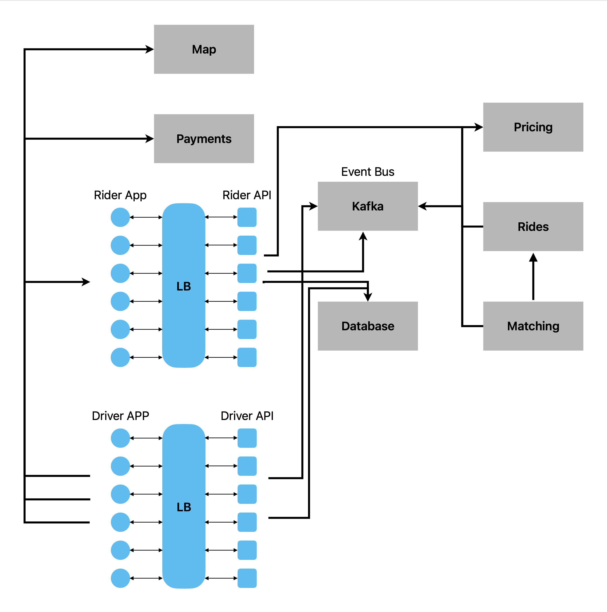
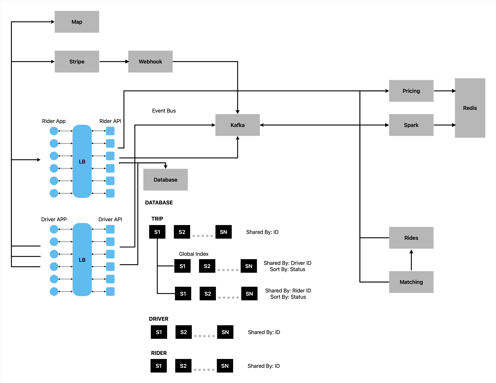

## Drivers & Riders 

### Problems: 
    Handle large number of users 
    Lots of realtime data 

        HTTP polling 
        Web Sockets 

### Problems: 

    Latency 
    Pulls API Drivers location. 

    * Websockets will help to maintain persistent connection, this helps to bring driver location on large scale.

By integrating the problems: 

New updated the System design will be: 

  

## Databases:

* Database will need to hold certain values. 

### TRIP 

    ID 
    DRIVER ID 
    RIDER ID 
    PRICE 
    PICKUP LOCATION 
    DESTINATION 
    DATE 
    STATUS 
    RIDE TYPE 

### DRIVER 

    ID 
    RIDE TYPE 
    CAR INFO 
    LOCATION 
    PHONE NUMBER 
    EMAIL 
    PASSWORD HASH 
    NAME 

### RIDER 

    ID 
    PAYMENT INFO 
    PHONE 
    EMAIL 
    PASSWORD HASH 
    NAME 

  

Its really important to scale database horizontally. 

* Global Index will get the RiderID and DriverID, Sort the data by status. 

  

## MAP: 

### Problems: 

* Serve Map images 
* Convert street address to lat/long
* Get Directions. 

Bunch of services for Map 

## Payments: 

### Problems: 
* Rider needs to pay API neets to know when payment finishes processing. 

All services need to attach to client side. 

### Pricing: 

* Pricing varies by demand batch processing would be too slow. 
* Batch processing would be too slow. 

  

## Rides: 

### Problems: 

* Needs to efficiently find drivers in an area. 
* Needs to calculate ETA6. 

* we don't know driver location, We going to use H3: 

## H3: 

* Hexagonal area of map, drivers will be located in each cell. 
* All hexagonal will be connected to each other, all drivers in that cell will get located. 

* CellID can be calculated from longitude/latitude. 
* One cell ID can be used to calculate adjacent cell IDs. 

* Using ETA service locate the driver nearest. 

## Matching: 

### Requirement: 

When a rider requests a ride: 

* Find closest driver using rides service. 
* Tell driver API to accept or decline the ride. 

### Accepted: 
* Notify rider. 
* Driver gets directions to pickup location. 

### Declined: 
* Repeat with next closest driver. 

## Next Steps: 

We can look into the mode details like: 

* Math 
* Redundancy 
* Algorithms for ETA Service. 
* Data Analytics. 
* Algorithms for sharing driver locations. 

  

Reference [reference](https://www.youtube.com/watch?v=R_agd5qZ26Y)